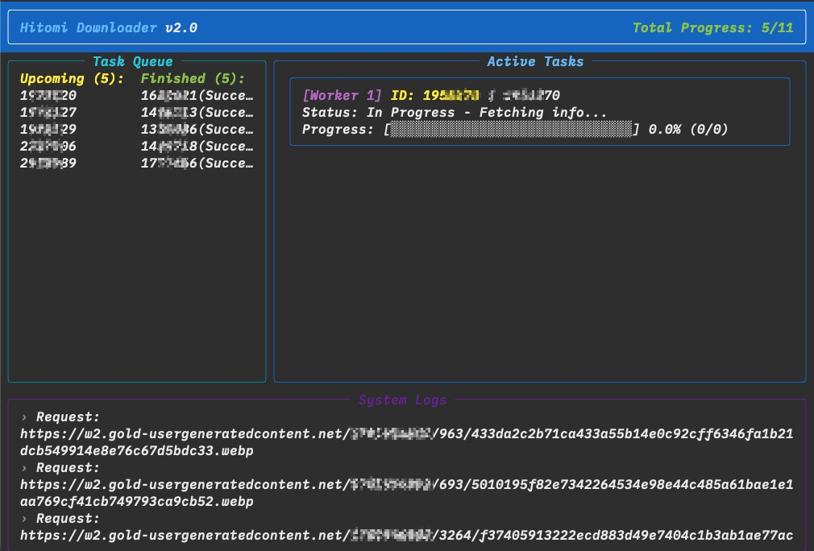

Translation by ChatGPT

---

# 2.0 Update 🎇

# Hitomi.la Downloader



A Python implementation for searching and downloading comics from hitomi.la.

Comics on jm have ads, and comics on eh require points to download. This website allows guests to download, but after checking, it seems that there isn't a reverse-engineered solution on GitHub, so I spent some time writing this.

Based on the reverse-engineered JS code of the website's client.

## Feel free to submit issues and pull requests.

## Features

- Supports proxies
- Retry mechanism
- **Multi-task Concurrent Download**: Supports starting multiple download tasks simultaneously to improve efficiency.
- **Random Rest Time**: Automatically rests for 10-30 seconds between tasks to reduce the risk of being banned.
- **Batch Download**: Supports inputting multiple IDs at once for downloading.

Run `hitomiv2.py` directly to search or download.

### 1. Download Comic

Supports downloading multiple IDs simultaneously and setting the concurrency level:

```bash
# Download a single ID
python hitomiv2.py -d 123456

# Download multiple IDs with a concurrency of 3
python hitomiv2.py -d 123456 789012 345678 -c 3

# Set the output directory
python hitomiv2.py -d 123456 -o ./my_comics
```

### 2. Search Comic

```bash
# Search by keyword
python hitomiv2.py -s "HayaseYuuka"
```

### Parameter Explanation

- `-d`, `--download`: Download specified Comic IDs, supports multiple IDs (space-separated).
- `-s`, `--search`: Search keywords.
- `-c`, `--concurrency`: Number of concurrent download tasks, default is 1 (sequential).
- `-o`, `--output`: Set the storage path for downloaded files.
- `-p`, `--proxy`: Set proxy address (e.g., `http://127.0.0.1:10809`).

### Chrome Extension

I just set up this neat Chrome extension called hitomi-copy-ext. It’s super simple—you just enable developer mode in Chrome, drag the folder into chrome://extensions/, and you're good to go. It lets you copy IDs with a single click so you can paste them right into the python script (python hitomiv2.py -d). It has saved me so much time already!

## Notes

1. **Initialization**  
   Due to the website’s anti-scraping mechanism, some parameters need to be retrieved for parsing. The initialization essentially requests and stores some parameters locally to avoid IP bans due to excessive requests. So, if an unhandled exception occurs and the script stops running, it won't cause any issues.
